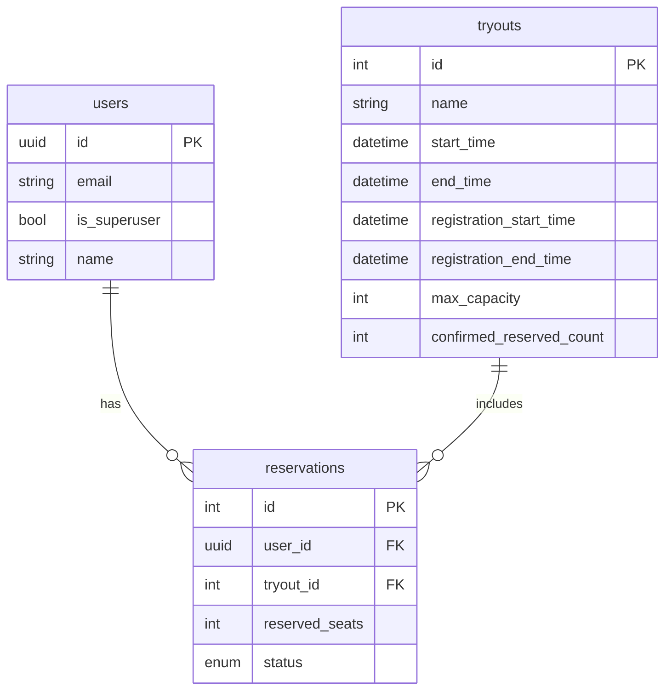

# 🧩 서비스 구조 및 ERD 문서

이 문서는 **시험 일정 예약 시스템 API**의 주요 데이터 모델, 관계, 그리고 프로젝트를 설계하면서 고민했던 구조적 결정 사항과 기술 적응 과정을 정리한 문서입니다.

---

## 📐 Entity Relationship Diagram (ERD)



## 📁 폴더 구조

```bash
backend/
├── app/
│   ├── core/            # 설정, 보안, 트랜잭션 유틸리티 (ex. config.py, security.py)
│   ├── models/          # SQLModel 기반 모델 정의 (DB + 스키마)
│   ├── repository/      # DB 접근 추상화 계층
│   ├── services/        # 비즈니스 로직 계층 (예약 로직, 검증 등)
│   ├── routers/         # FastAPI 라우터 정의 (tryouts.py, reservations.py)
│   ├── tests/           # 테스트 코드 (routers, scripts 별로 분리)
│   ├── main.py          # FastAPI 엔트리포인트 (API 등록)
│   └── dependencies.py  # Depends 기반 공통 유저/세션 주입처리
├── alembic/             # 마이그레이션 스크립트 관리
├── Dockerfile
├── docker-compose.yml
└── pyproject.toml       # 의존성 및 설정 파일
```

### 📌 주요 관계

- `users` : 고객과 어드민을 포함한 사용자 테이블
- `tryouts` : 시험 일정 정보. 예약 가능한 시간/인원 등을 포함
- `reservations` : 사용자의 예약 요청과 상태를 저장. 중복 방지를 위해 `(user_id, tryout_id)`에 unique 제약

---

### 📌 폴더 구조 설계 이유

- **app 단위**로 모든 내부 코드가 집중되도록 구성해 유지보수성과 테스트 편의성 확보
- `core`, `models`, `repository`, `services`, `routers`를 명확히 나눠 **MVC 구조와 유사한 계층 구분**을 적용
- `services`는 트랜잭션 처리, 유효성 검사, 예외 처리를 담당하고, 외부에서는 이 계층만 호출하도록 함

---

## ⚙️ 왜 이렇게 구조를 가져갔는가

### ✅ 1. 고객과 어드민을 하나의 사용자 테이블로 관리한 이유

- 초기에는 기업 고객만 예약을 생성한다는 가정이 있었지만, 추후 **개인 고객(예: 수험생 등)** 도 접속할 수 있는 서비스로 확장될 가능성을 고려해 `users` 테이블 하나에서 `is_superuser` 필드로 역할을 구분하는 방식으로 설계했습니다.
- 더 복잡해지면 `role`이나 `user_type`으로 확장할 수 있도록 열려 있는 구조입니다.

### ✅ 2. 최대 수용 인원 제약 처리 방식

- 현재는 `confirmed_reserved_count` 필드를 tryout 테이블에 유지하고, 예약 확정 시 이 값을 증가시키는 방식으로 수용 인원을 제한합니다.
- 동시성 문제를 방지하기 위해 트랜잭션 내에서 `SELECT FOR UPDATE`를 사용해 처리하고 있습니다.
- 하지만 이러한 방식은 트래픽이 많아질 경우 **DB I/O 병목**을 일으킬 수 있기 때문에,
  추후 수십만 명이 동시에 몰리는 대규모 서비스 상황을 고려해 다음을 검토하고 있습니다:
  - **Redis에 tryout별 예약 확정 인원을 캐싱**하여, 실시간으로 `confirmed_reserved_count` 값을 메모리에서 관리
  - 주기적으로 Redis 값을 DB로 동기화하는 구조로 변경

### ✅ 3. 일반 고객 확장 가능성

> 처음에는 어드민과 기업 고객만이 사용한다고 가정했지만,
> 서비스를 오픈한 이후에는 **일반 고객도 직접 시험을 예약할 수 있는 구조로 확장**될 수 있음.
> 최대한 **권한 분리와 예약 관리 로직을 유연하게 설계**하고자 했고, FastAPI의 `Depends`를 통해 권한 검증 로직을 계층적으로 처리

### ✅ 4: 동시간대 중복 예약 방지

- 단순히 tryout ID 중복을 막는 것이 아니라, **시간이 겹치는 예약**을 막아야 함
- 이 부분은 서비스 코드에서 start_time/end_time 겹침 여부를 쿼리로 검사하여 처리했습니다
